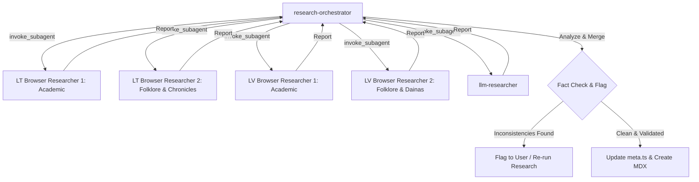

# Parallel Deity Research Workflow

This workflow orchestrates five parallel research subagents and a single fact-checking consolidation editor to ensure deep coverage, academic referencing, and absolute consistency for Baltic deities and spirits.

---

## The Execution Model

---

## Step-by-Step Workflow

### Step 1: Task Spawning (Editor)
When a deity or myth is requested for research, the **research-orchestrator** invokes 5 subagents in parallel with the following specialized prompts and scopes:

1. **LT Browser Researcher 1 (Academic)**:
   - **Scope**: Lithuanian academic archives, VLE (Universal Lithuanian Encyclopedia), Alkas.lt, researchgate.net, and academic papers.
   - **Target**: Find first historical mentions, linguistic etymology, and modern archaeological or ethnological evaluations.
   
2. **LT Browser Researcher 2 (Folklore & Chronicles)**:
   - **Scope**: LLTI (Institute of Lithuanian Literature and Folklore - llti.lt), Jonas Basanavičius collections, regional folklore databases, and historical chronicles (Stryjkowski, Łasicki, Chronicles of Prussia).
   - **Target**: Find specific Samogitian/Aukštaitijan tales, sacred sites (groves, stones), and ritual details.

3. **LV Browser Researcher 1 (Academic)**:
   - **Scope**: Latvian National Encyclopedia (enciklopedija.lv), university repositories (LU, LKA), and academic journals on Baltic mythology.
   - **Target**: Find first historical mentions in Livonian chronicles, Latvian linguistic etymologies, and academic interpretations.

4. **LV Browser Researcher 2 (Folklore & Dainas)**:
   - **Scope**: LFK (Latvian Folklore Archives - lfk.lv), Krišjānis Barons Dainas collections (dainuskapis.lv), and regional folklore databases (Latgale, Kurzeme, Vidzeme, Semigallia).
   - **Target**: Find Latvian folk tales, dainas (folk songs) referencing the deity, sacred sites (mounds, oak trees), and ritual details.

5. **llm-researcher**:
   - **Scope**: Internal LLM training data.
   - **Target**: Extract cognates across different Baltic tribes (Lithuanians, Latvians, Curonians, Semigallians, Old Prussians), identify the earliest historical period of mention, and list known appearance/iconography summaries.

---

### Step 2: Parallel Search & Data Gathering (Subagents)
Each subagent performs its task in its workspace, saving findings, web search hits, and URLs. 
- Web crawlers must capture **exact URLs** and book titles.
- Academic references must be cited in the required style: `Author: Title (Year)` or `Archive ID`.

---

### Step 3: Synthesis & Cross-Checking (Editor)
Upon receiving the reports, the **research-orchestrator** performs a comprehensive validation:

1. **Compare Key Metadata**:
   - Verify that the tribe, sub-region, and historical period align.
   - *Example contradiction*: Lithuanian sources claim Aukštaitijan tribe; Latvian sources claim Curonian.
2. **Check Reference Requirements (MANDATORY)**:
   - Ensure there are **at least 2 valid primary or secondary academic references**.
   - If references are missing or unverified, the entry **must be flagged as Unverified** and the user notified.
3. **Identify & Remove Romantic Reconstructions**:
   - Flag 19th-century romantic "fakes" or inventions (e.g. Teodor Narbutt's unverified deities) unless specifically marked as modern/romantic reconstructions.
4. **Harmonize Languages**:
   - Ensure the name and summary localization objects contain correct equivalents for `{ en, lt, lv }`.

---

### Step 4: Metadata and File Output
- Format the metadata block conforming to the `DeityMeta` or `StoryMeta` interface in [content.ts](file:///c:/Users/ITWORK/source/repos/baltic-gods/src/types/content.ts).
- Write/update [meta.ts (Deities)](file:///c:/Users/ITWORK/source/repos/baltic-gods/src/content/deities/meta.ts) or [meta.ts (Stories)](file:///c:/Users/ITWORK/source/repos/baltic-gods/src/content/stories/meta.ts).
- Create the primary English story file `src/content/stories/en/[slug].mdx` with placeholders or translations for `lt`/`lv`.
